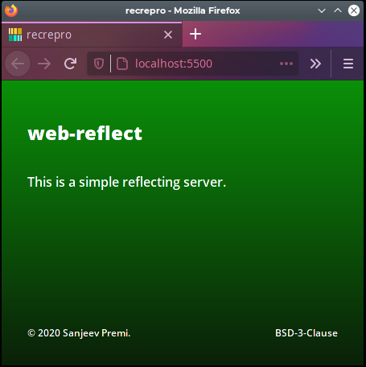
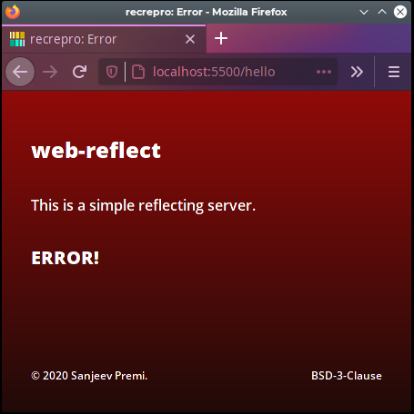
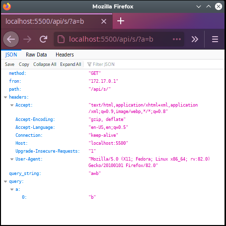

# web-reflect : Screenshots &amp; Examples

**[BACK](../README.md)** to README.

## Screenshots

### Success page in browser


### Error page in browser


### Successful GET in browser


## Example

Here is output of the **test** script, when application is running in
a docker container.

```console
$ ./test.sh
::
:: Testing web-reflect
::
 : Using port 5500
::

:: GET    (TEXT) /api/s
{"method": "GET", "from": "172.17.0.1", "path": "/api/s", "headers": {"Accept": "*/*", "Content-Length": "5", "Content-Type": "text/plain", "Host": "localhost:5500", "User-Agent": "curl/7.66.0"}, "query_string": "", "query": {}}
200

:: GET    (TEXT) /api/e
{"method": "GET", "from": "172.17.0.1", "path": "/api/e"}
404

:: GET    (TEXT) /api/s?a=b&c=d
{"method": "GET", "from": "172.17.0.1", "path": "/api/s", "headers": {"Accept": "*/*", "Content-Length": "5", "Content-Type": "text/plain", "Host": "localhost:5500", "User-Agent": "curl/7.66.0"}, "query_string": "a=b&c=d", "query": {"a": ["b"], "c": ["d"]}}
200

:: GET    (JSON) /api/s
{"method": "GET", "from": "172.17.0.1", "path": "/api/s", "headers": {"Accept": "*/*", "Content-Length": "36", "Content-Type": "application/json", "Host": "localhost:5500", "User-Agent": "curl/7.66.0"}, "query_string": "", "query": {}}
200

:: GET    (JSON) /api/e
{"method": "GET", "from": "172.17.0.1", "path": "/api/e"}
404

:: GET    (JSON) /api/s?a=b&c=d
{"method": "GET", "from": "172.17.0.1", "path": "/api/s", "headers": {"Accept": "*/*", "Content-Length": "36", "Content-Type": "application/json", "Host": "localhost:5500", "User-Agent": "curl/7.66.0"}, "query_string": "a=b&c=d", "query": {"a": ["b"], "c": ["d"]}}
200

:: POST   (TEXT) /api/s
{"payload": "Hello", "method": "POST", "from": "172.17.0.1", "path": "/api/s", "headers": {"Accept": "*/*", "Content-Length": "5", "Content-Type": "text/plain", "Host": "localhost:5500", "User-Agent": "curl/7.66.0"}, "query_string": "", "query": {}}
200

:: POST   (TEXT) /api/e
{"method": "POST", "from": "172.17.0.1", "path": "/api/e"}
404

:: POST   (TEXT) /api/s?a=b&c=d
{"method": "POST", "from": "172.17.0.1", "path": "/api/s"}
418

:: POST   (JSON) /api/s
{"method": "POST", "from": "172.17.0.1", "path": "/api/s", "payload": {"name": "abc", "email": "abc@def.com"}, "headers": {"Accept": "*/*", "Content-Length": "36", "Content-Type": "application/json", "Host": "localhost:5500", "User-Agent": "curl/7.66.0"}, "query_string": "", "query": {}}
200

:: POST   (JSON) /api/e
{"method": "POST", "from": "172.17.0.1", "path": "/api/e"}
404

:: POST   (JSON) /api/s?a=b&c=d
{"method": "POST", "from": "172.17.0.1", "path": "/api/s"}
418

:: PUT    (TEXT) /api/s
{"method": "PUT", "from": "172.17.0.1", "path": "/api/s", "payload": "Hello", "headers": {"Accept": "*/*", "Content-Length": "5", "Content-Type": "text/plain", "Host": "localhost:5500", "User-Agent": "curl/7.66.0"}, "query_string": "", "query": {}}
200

:: PUT    (TEXT) /api/e
{"method": "PUT", "from": "172.17.0.1", "path": "/api/e"}
404

:: PUT    (TEXT) /api/s?a=b&c=d
{"method": "PUT", "from": "172.17.0.1", "path": "/api/s"}
418

:: PUT    (JSON) /api/s
{"method": "PUT", "from": "172.17.0.1", "path": "/api/s", "payload": {"name": "abc", "email": "abc@def.com"}, "headers": {"Accept": "*/*", "Content-Length": "36", "Content-Type": "application/json", "Host": "localhost:5500", "User-Agent": "curl/7.66.0"}, "query_string": "", "query": {}}
200

:: PUT    (JSON) /api/e
{"method": "PUT", "from": "172.17.0.1", "path": "/api/e"}
404

:: PUT    (JSON) /api/s?a=b&c=d
{"method": "PUT", "from": "172.17.0.1", "path": "/api/s"}
418

:: DELETE (TEXT) /api/s
{"method": "DELETE", "from": "172.17.0.1", "path": "/api/s", "payload": "Hello", "headers": {"Accept": "*/*", "Content-Length": "5", "Content-Type": "text/plain", "Host": "localhost:5500", "User-Agent": "curl/7.66.0"}, "query_string": "", "query": {}}
200

:: DELETE (TEXT) /api/e
{"method": "DELETE", "from": "172.17.0.1", "path": "/api/e"}
404

:: DELETE (TEXT) /api/s?a=b&c=d
{"method": "DELETE", "from": "172.17.0.1", "path": "/api/s"}
418

:: DELETE (JSON) /api/s
{"method": "DELETE", "from": "172.17.0.1", "path": "/api/s", "payload": {"name": "abc", "email": "abc@def.com"}, "headers": {"Accept": "*/*", "Content-Length": "36", "Content-Type": "application/json", "Host": "localhost:5500", "User-Agent": "curl/7.66.0"}, "query_string": "", "query": {}}
200

:: DELETE (JSON) /api/e
{"method": "DELETE", "from": "172.17.0.1", "path": "/api/e"}
404

:: DELETE (JSON) /api/s?a=b&c=d
{"method": "DELETE", "from": "172.17.0.1", "path": "/api/s"}
418
```

**[BACK](../README.md)** to README.
